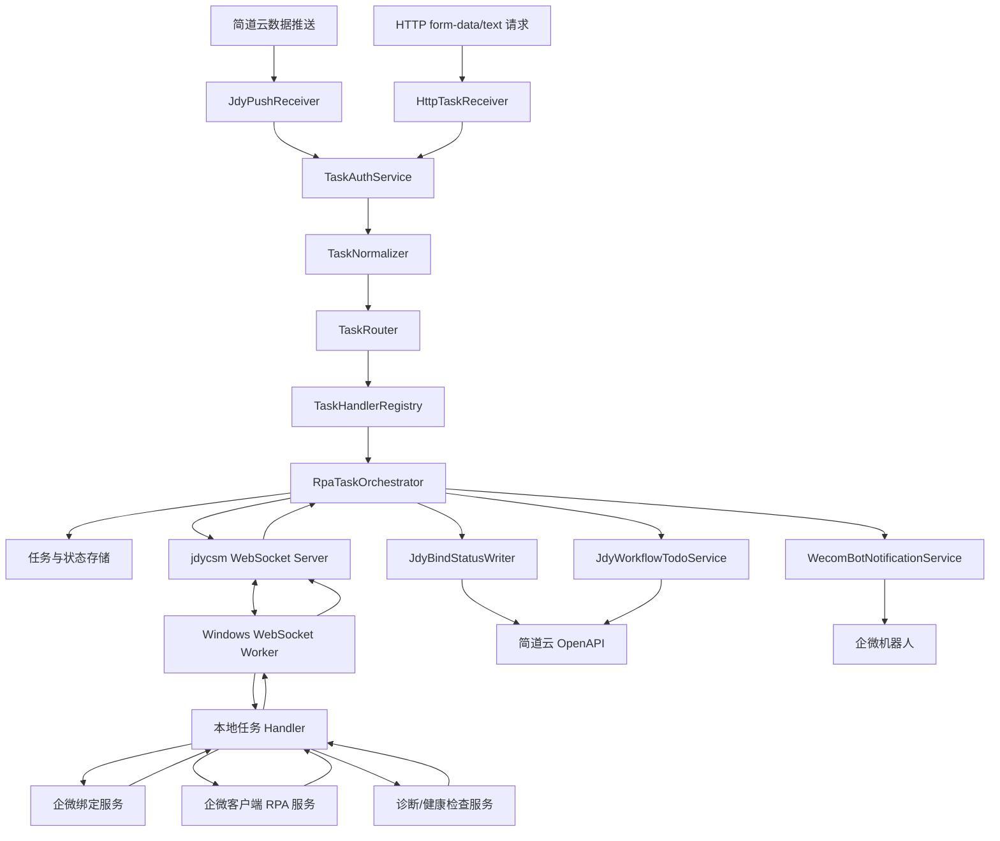

# jdycsm RPA 任务编排与企微绑定自动化设计

状态：2026-06-18 草案
适用范围：jdycsm 控制面、RPA_GROUP Windows WebSocket Worker、通用 RPA 任务编排、企微绑定服务、企微客户端 RPA、简道云回写和流程待办处理
非目标：不改旧 `RPA.py`，不让 Windows Server 暴露公网业务接口，不把简道云表单字段、企微机器人 webhook、Cookie 或密钥写死在任何任务主链路中

## 1. 背景

Windows Server 真实企微绑定链路已经验证通过。当前已通过脚本完成多单真实写入，链路包括：

- 简道云后台只读预检。
- 企微开发者后台只读预检。
- 简道云安装/写入 `token`、`encoding_aes_key`。
- 企微保存开发配置、权限、试用规则、授权域名。
- 创建企微上线单并提交。
- 敏感字段脱敏输出。

已验证示例：

| 客户输入名 | 实际绑定展示名 | 结果 | 上线单 |
| --- | --- | --- | --- |
| 平阳爱康箱包有限公司 | ICOM | success | au20260618080924884 |
| 地球公社江门店 | 地球公社江门店 | success | au20260618082503239 |
| 保定拓通大件货物运输有限公司 | 拓通大件物流 | success | au20260618083348546 |

这些结果说明 Windows 执行环境和企微绑定主体链路可用。下一阶段重点不再是扩展手工脚本，而是把已跑通的链路产品化为异步、可回写、可提醒、可恢复的通用 RPA 任务系统。

企微绑定只是第一个已验证任务。后续还会接入企微建群、企微解散群、企微群发消息、环境诊断、登录态检查等任务。因此控制面不能设计成“企微绑定专用编排”，而应设计成“通用任务接入、路由、调度、回写、流程处理平台”。

## 2. 设计目标

1. jdycsm 负责接收 HTTP 请求和简道云推送、创建任务、维护状态机、回写简道云、处理流程待办。
2. 触发入口支持两类：普通 HTTP 请求加请求头鉴权；简道云数据推送加推送鉴权。
3. 普通 HTTP 请求体必须支持扁平 key-value，不依赖嵌套 JSON；优先支持 `form-data` 和 `x-www-form-urlencoded`，兼容简道云 HTTP 请求节点当前只支持 text/form-data 的限制。
4. 任务编排层按 `task_type` 或来源表配置判断执行什么任务，不绑定企微绑定单一任务。
5. Windows Server 只作为执行面，通过 WebSocket 主动反连 jdycsm，不接收入站业务 HTTP。
6. 每类 RPA 任务封装为独立 handler，输入标准任务请求，输出标准状态和上下文。
7. 企微机器人封装为独立通知模块，由编排层按状态调用。
8. 简道云回写、流程提交、流程回退封装为可插拔模块，支持两张来源表的差异化策略。
9. 用户不必填写 `short_name`。企微绑定任务应在安全条件满足时，从简道云 `corp.name` 自动解析 `bind_display_name`。
10. 每类任务声明自己的 worker capability 和 runtime health checks，不能用一个笼统的“登录态检查”覆盖企微 Web 后台、简道云 Web 后台、企微客户端和 Windows 交互桌面。
11. 所有真实写入必须可审计、可幂等、可恢复，失败后能明确进入可解释状态。

## 3. 触发入口

### 3.1 普通 HTTP 请求

普通 HTTP 请求用于外部系统、后台管理页、简道云 HTTP 请求节点或人工补偿触发。

鉴权方式：

- 请求头鉴权，第一版可使用 `X-API-Key` 或 `Authorization: Bearer <token>`。
- 鉴权模块只做身份和权限校验，不做业务路由。
- 不同调用方可以配置允许的 `task_type` 白名单。

请求体约束：

- 必须支持扁平 key-value。
- 支持 `multipart/form-data`。
- 支持 `application/x-www-form-urlencoded`。
- 可选支持 `text/plain`，内容格式为每行 `key=value` 或 URL query string。
- 不要求调用方构造嵌套 JSON。

不推荐格式：

```json
{
  "task_type": "wecom_bind_service",
  "payload": {
    "enterprise_name": "客户名称",
    "plain_corp_id": "ww..."
  }
}
```

推荐 form-data：

```text
task_type=wecom_bind_service
enterprise_name=保定拓通大件货物运输有限公司
plain_corp_id=ww_example_corp_id
requested_user_id=user_example_requester
source=manual_http
external_request_id=req_001
```

企微建群示例：

```text
task_type=wecom_group_create
customer_name=上海测试客户
group_name=上海测试客户服务群
owner_name=张三
source=manual_http
```

这种设计是为了兼容简道云 HTTP 请求节点。简道云节点可以直接配置 form-data 或 text，不需要拼复杂 JSON。

### 3.2 简道云数据推送

简道云数据推送用于表单数据新增、更新或流程流转触发。推送本身携带 `app_id`、`form_id` 或 `entry_id`、`data_id`，jdycsm 需要根据来源配置识别任务类型。

鉴权方式：

- 使用简道云数据推送的签名或 token 校验机制。
- 校验推送来源是否在允许的 `app_id + form_id` 白名单中。
- 校验成功后才进入标准化和任务路由。

标准化后至少包含：

```json
{
  "trigger_type": "jdy_data_push",
  "app_id": "app_xxx",
  "form_id": "form_xxx",
  "data_id": "data_xxx",
  "flat_fields": {
    "enterprise_name": "客户名称",
    "plain_corp_id": "ww...",
    "requested_user_id": "user..."
  }
}
```

简道云推送不要求直接携带 `task_type`。如果未携带，`TaskRouter` 根据 `app_id + form_id` 的来源配置推导任务类型。

## 4. 任务类型与路由

任务编排层是通用 RPA 平台能力，不是企微绑定专用逻辑。所有任务都进入统一 intake、auth、normalize、route、store、dispatch 流程。

第一批任务类型建议：

| task_type | 说明 | 执行方式 | required_capability |
| --- | --- | --- | --- |
| wecom_bind_service | 企微服务商绑定 | 企微/简道云 Web 后台接口链路 | wecom_bind_service |
| wecom_group_create | 企微建群 | Windows 企微客户端 RPA | wecom_group_create |
| wecom_group_dismiss | 企微解散群 | Windows 企微客户端 RPA | wecom_group_dismiss |
| wecom_group_send_message | 企微群发消息 | Windows 企微客户端 RPA | wecom_group_send_message |
| diagnostics | Windows 执行环境诊断 | 本地只读检查 | diagnostics |
| runtime_health_check | 指定运行态健康检查 | 本地只读检查 | runtime_health_check |

`TaskRouter` 输入：

```json
{
  "trigger_type": "http_form",
  "task_type": "wecom_bind_service",
  "app_id": null,
  "form_id": null,
  "flat_fields": {}
}
```

`TaskRouter` 输出：

```json
{
  "task_type": "wecom_bind_service",
  "task_handler": "WecomBindTaskHandler",
  "required_capability": "wecom_bind_service",
  "required_health_checks": [
    "jdy_admin_web",
    "wecom_admin_web",
    "browser_profile"
  ],
  "source_policy": "manual_http_default"
}
```

路由规则优先级：

1. 如果 HTTP 请求显式传 `task_type`，先校验调用方是否有权限触发该类型。
2. 如果是简道云推送且未传 `task_type`，按 `app_id + form_id` 查来源配置推导。
3. 如果来源配置和请求体同时给出 `task_type`，必须一致，否则拒绝。
4. 未识别任务进入 `rejected_unknown_task_type`，不下发 Windows。

## 5. 总体架构



核心原则：

- jdycsm 是控制面和编排层。
- Windows Worker 是执行面。
- 任务入口、鉴权、标准化、路由和执行 handler 注册表解耦。
- 企微绑定服务只负责绑定事实，是多个 RPA 任务 handler 之一。
- 企微客户端 RPA 任务与企微 Web 后台任务分开声明能力和健康检查。
- 简道云回写服务只负责字段映射和数据更新。
- 简道云流程服务只负责查询待办、提交、回退。
- 企微机器人服务只负责通知。

## 6. 模块边界

### 6.1 HttpTaskReceiver

职责：

- 接收普通 HTTP 请求。
- 支持 `multipart/form-data`、`application/x-www-form-urlencoded`、`text/plain`。
- 将请求体解析成扁平 `flat_fields`。
- 提取请求头鉴权信息。
- 不做业务路由，不直接创建 Windows 任务。

输出示例：

```json
{
  "trigger_type": "http_form",
  "auth_context": {
    "auth_type": "api_key",
    "caller": "jdy_http_node"
  },
  "flat_fields": {
    "task_type": "wecom_bind_service",
    "enterprise_name": "客户名称",
    "plain_corp_id": "ww..."
  }
}
```

### 6.2 JdyPushReceiver

职责：

- 接收简道云数据推送。
- 校验签名、来源、必要字段。
- 提取 `app_id`、`entry_id` 或 `form_id`、`data_id`、推送数据。
- 生成统一 `BindRequestSource`。
- 不做业务决策，不调用 Windows，不直接改流程。

建议标准输入：

```json
{
  "source": "jiandaoyun_push",
  "app_id": "app_xxx",
  "form_id": "form_xxx",
  "data_id": "instance_or_data_id",
  "raw_fields": {}
}
```

### 6.3 TaskAuthService

职责：

- 校验 HTTP 请求头鉴权。
- 校验简道云数据推送鉴权。
- 校验来源是否允许触发 RPA 任务。
- 校验调用方是否有权限触发目标 `task_type`。
- 生成 `caller_context`，供审计和限流使用。

鉴权策略按入口分开：

| 入口 | 鉴权方式 | 失败状态 |
| --- | --- | --- |
| HTTP form/text | `X-API-Key` 或 `Authorization` | rejected_auth_failed |
| 简道云数据推送 | 简道云推送签名/token | rejected_jdy_push_auth_failed |

### 6.4 TaskNormalizer

职责：

- 把不同入口统一成扁平 `TaskRequest`。
- 统一字段命名，例如 `entry_id`、`form_id`、`data_id`。
- 去掉空字符串、规范布尔值、数字和枚举。
- 生成标准 `source`、`flat_fields`、`raw_ref`。
- 不做具体业务校验。

统一输出示例：

```json
{
  "trigger_type": "http_form",
  "source": {
    "source_type": "manual_http",
    "app_id": null,
    "form_id": null,
    "data_id": null
  },
  "flat_fields": {
    "task_type": "wecom_group_create",
    "customer_name": "上海测试客户",
    "group_name": "上海测试客户服务群"
  }
}
```

### 6.5 TaskRouter

职责：

- 根据 `app_id + form_id` 识别来源表。
- 区分外链表和队内流程表。
- 根据 `task_type` 或来源表配置推导任务类型。
- 读取该来源表的字段映射、流程策略、回写策略。
- 找到对应 `TaskHandler`。
- 输出 `required_capability`、`required_health_checks`、`status_writer`、`workflow_policy`。

两类来源表策略：

| 来源类型 | 数据来源 | 是否可回写状态 | 是否可提交待办 | 是否可回退待办 |
| --- | --- | --- | --- | --- |
| external_link_form | 外链表 | 是 | 视配置而定 | 否 |
| internal_workflow_form | 队内流程表 | 是 | 是 | 是 |

外链表无法回退，因此失败时只回写状态和原因，不调用 rollback。

### 6.6 TaskHandlerRegistry

职责：

- 管理 `task_type -> handler` 映射。
- 管理 `task_type -> required_capability`。
- 管理 `task_type -> required_health_checks`。
- 管理任务 payload schema。

示例：

```yaml
handlers:
  wecom_bind_service:
    handler: WecomBindTaskHandler
    required_capability: wecom_bind_service
    required_health_checks:
      - jdy_admin_web
      - wecom_admin_web
      - browser_profile

  wecom_group_create:
    handler: WecomGroupCreateTaskHandler
    required_capability: wecom_group_create
    required_health_checks:
      - wecom_client_app
      - interactive_desktop
```

### 6.7 RpaTaskOrchestrator

职责：

- 创建 RPA 任务。
- 维护状态机。
- 生成 `idempotency_key`。
- 调度 Windows Worker。
- 接收 worker progress/result。
- 根据结果调用回写、流程、机器人模块。

不应直接依赖：

- 具体简道云字段 ID。
- 具体企微机器人 webhook。
- Windows 本地 Cookie 文件路径。
- 某一张表的流程节点细节。

### 6.8 Windows WebSocket Worker

职责：

- 主动连接 jdycsm WebSocket。
- 注册 `machine_id`、`robot_id`、能力、登录态摘要。
- 单并发领取任务。
- 根据 `task_type` 调用本地任务 handler。
- 回传进度和结果。

不负责：

- 接收简道云推送。
- 判断简道云流程提交或回退。
- 直接调用简道云表单回写。
- 直接发送企微机器人提醒。

### 6.9 本地任务 Handler

每类任务有独立 handler。handler 负责把平台任务请求转换成本地服务调用，并把本地服务结果转换成标准 `task.progress` / `task.result`。

建议第一批 handler：

| handler | task_type | 本地服务 |
| --- | --- | --- |
| WecomBindTaskHandler | wecom_bind_service | WecomBindService |
| WecomGroupCreateTaskHandler | wecom_group_create | WecomClientRpaService |
| WecomGroupDismissTaskHandler | wecom_group_dismiss | WecomClientRpaService |
| WecomGroupSendMessageTaskHandler | wecom_group_send_message | WecomClientRpaService |
| DiagnosticsTaskHandler | diagnostics | WindowsDiagnosticsService |

handler 不直接回写简道云，不直接调用机器人。

### 6.10 WecomBindService

企微绑定主体服务是已验证链路的正式封装。它应以标准请求作为输入：

```json
{
  "enterprise_name": "保定拓通大件货物运输有限公司",
  "bind_display_name": "拓通大件物流",
  "plain_corp_id": "ww_example_corp_id",
  "requested_user_id": "user_example_requester",
  "suite_id": 1,
  "suite_scenario": "main",
  "wecom_suiteid": 1009479,
  "suite_name": "简道云"
}
```

建议 pipeline：

```text
resolve_bind_display_name
-> jdy_readonly_preflight
-> wecom_readonly_preflight
-> jdy_install_or_update_secret
-> wecom_save_development_info
-> wecom_set_privileges
-> wecom_set_trial_rule
-> wecom_set_sso_redirect_domain
-> wecom_create_online_order
-> wait_online_delay
-> wecom_submit_online_order
```

输出必须是事实型结果，不嵌入编排决策：

```json
{
  "status": "success",
  "reason": "wecom_online_order_submitted",
  "context": {
    "enterprise_name": "保定拓通大件货物运输有限公司",
    "bind_display_name": "拓通大件物流",
    "auditorderid": "au20260618083348546"
  }
}
```

### 6.11 WecomClientRpaService

职责：

- 封装企微客户端自动化能力。
- 支持建群、解散群、群发消息等 GUI RPA。
- 依赖 Windows 交互桌面、企微客户端登录态、固定分辨率和截图资源。
- 输出标准步骤结果、截图 artifact 索引和失败原因。

与企微绑定服务的区别：

| 服务 | 主要依赖 | 登录态 |
| --- | --- | --- |
| WecomBindService | 简道云后台 Web、企微开发者后台 Web | `jdy_admin_web`、`wecom_admin_web` |
| WecomClientRpaService | Windows 企微客户端、交互桌面 | `wecom_client_app`、`interactive_desktop` |

两者不能共用一个笼统的 cookie check。

### 6.12 WecomBotNotificationService

职责：

- 接收标准通知事件。
- 根据通知类型、环境、任务来源、责任人选择机器人。
- 调用企微机器人。
- 记录通知结果。

绑定服务不直接写死机器人。登录失效、人工处理、失败告警都由编排层调用通知服务。

示例事件：

```json
{
  "type": "wecom_admin_login_expired",
  "task_id": "task_xxx",
  "robot_id": "windows-rpa-01",
  "message": "企微开发者后台登录态失效，请在 Windows Server 重新登录。",
  "action_url": "https://jdycsm.example.com/rpa/tasks/task_xxx"
}
```

### 6.13 JdyBindStatusWriter

职责：

- 根据来源表配置把内部状态映射成简道云字段。
- 调用简道云数据更新接口。
- 写入状态、原因、绑定展示名、上线单号、执行时间、错误摘要等。
- 保持幂等，重复写同一状态不会造成业务副作用。

它不决定流程提交或回退，只负责“记录事实”。

### 6.14 JdyWorkflowTodoService

职责：

- 通过 `instance_id` 查询流程实例。
- 筛选固定处理账号的当前待办。
- 提交流程待办。
- 回退流程待办。
- 对外提供统一动作：`approve_current_task()`、`rollback_current_task()`。

官方接口约束：

- 查询流程实例：`POST /api/v6/workflow/instance/get`，`instance_id` 必填且同 `data_id`，`tasks_type=1` 可返回待办列表。返回字段包括 `tasks[].task_id`、`tasks[].assignee`、`tasks[].flow_id`、`tasks[].status` 等。参考：[查询流程实例信息](https://hc.jiandaoyun.com/open/16051)。
- 提交流程待办：`POST /api/v1/workflow/task/approve`，需要 `username`、`instance_id`、`task_id`，且 `task_id` 要和 `username` 对应。参考：[流程待办提交](https://hc.jiandaoyun.com/open/16054)。
- 回退流程待办：`POST /api/v2/workflow/task/rollback`，需要 `username`、`instance_id`、`task_id`，可选 `flow_id`、`comment`、`back_type`。参考：[流程待办回退](https://hc.jiandaoyun.com/open/16055)。

关键点：

- 推送里的 `data_id` 可以作为 `instance_id`。
- 推送里不一定有当前待办 `task_id`。
- 因此流程模块必须先按 `instance_id` 查流程实例，再从 `tasks` 中筛选固定处理账号的进行中待办。
- 若找不到该账号待办，不能盲目提交或回退，应进入 `manual_review`。

## 7. Runtime Health Checks

`runtime_health_check` 不是一个单一任务，而是一组按凭证域、运行环境和客户端类型拆开的检查能力。每个业务任务通过 `required_health_checks` 声明自己依赖哪些检查。

建议第一批 health check：

| health_check | 检查对象 | 用途 | 失败状态 |
| --- | --- | --- | --- |
| jdy_admin_web | 简道云后台 Web 登录态 | 企微绑定查询/写入简道云后台 | jdy_session_expired |
| wecom_admin_web | 企微开发者后台 Web 登录态 | 企微绑定读取/写入代开发应用 | wecom_session_expired |
| browser_profile | 浏览器 profile 可读可写 | Web 后台自动化和 cookie 抓取 | browser_profile_unavailable |
| wecom_client_app | Windows 企业微信客户端登录态 | 建群、解散群、群发消息 | wecom_client_unavailable |
| interactive_desktop | Windows 交互桌面、分辨率、锁屏状态 | GUI RPA 类任务 | desktop_unavailable |
| image_assets | 截图资源和识别模板 | GUI RPA 类任务 | image_assets_missing |

任务依赖示例：

```yaml
task_types:
  wecom_bind_service:
    required_capability: wecom_bind_service
    required_health_checks:
      - jdy_admin_web
      - wecom_admin_web
      - browser_profile

  wecom_group_create:
    required_capability: wecom_group_create
    required_health_checks:
      - wecom_client_app
      - interactive_desktop
      - image_assets

  wecom_group_dismiss:
    required_capability: wecom_group_dismiss
    required_health_checks:
      - wecom_client_app
      - interactive_desktop
      - image_assets

  wecom_group_send_message:
    required_capability: wecom_group_send_message
    required_health_checks:
      - wecom_client_app
      - interactive_desktop
      - image_assets
```

Worker heartbeat 建议上报脱敏摘要：

```json
{
  "runtime_health": {
    "jdy_admin_web": {
      "status": "ok",
      "checked_at": "2026-06-18T09:00:00+08:00"
    },
    "wecom_admin_web": {
      "status": "expired",
      "reason": "outsession",
      "checked_at": "2026-06-18T09:00:00+08:00"
    },
    "wecom_client_app": {
      "status": "ok",
      "checked_at": "2026-06-18T09:00:00+08:00"
    },
    "interactive_desktop": {
      "status": "ok",
      "session_name": "RDP-Tcp#0",
      "checked_at": "2026-06-18T09:00:00+08:00"
    }
  }
}
```

调度规则：

1. `TaskRouter` 根据任务类型取 `required_health_checks`。
2. `RpaTaskOrchestrator` 根据 worker 最近 heartbeat 判断是否满足。
3. 如果缺少必要 health check，不下发任务，进入明确等待态或失败态。
4. 登录态失效类问题调用 `WecomBotNotificationService` 提醒人工处理。
5. GUI RPA 的桌面不可用问题暂停所有依赖 `interactive_desktop` 的任务。

## 8. 标准请求模型

建议内部任务使用统一 `TaskRequest`，保持外层结构通用，任务参数放在扁平 `task_payload` 中。`task_payload` 可以由 HTTP form-data/text 或简道云推送字段标准化而来。

```json
{
  "task_id": "task_xxx",
  "task_type": "wecom_bind_service",
  "idempotency_key": "rpa_task:app_xxx:form_xxx:data_xxx",
  "source": {
    "source_type": "internal_workflow_form",
    "app_id": "app_xxx",
    "form_id": "form_xxx",
    "data_id": "data_xxx"
  },
  "operator": {
    "workflow_username": "fixed_account_username"
  },
  "routing": {
    "required_capability": "wecom_bind_service",
    "required_health_checks": [
      "jdy_admin_web",
      "wecom_admin_web",
      "browser_profile"
    ],
    "task_handler": "WecomBindTaskHandler"
  },
  "task_payload": {
    "enterprise_name": "保定拓通大件货物运输有限公司",
    "bind_display_name": null,
    "plain_corp_id": "ww_example_corp_id",
    "requested_user_id": "user_example_requester",
    "suite_id": 1,
    "suite_scenario": "main",
    "wecom_suiteid": 1009479,
    "suite_name": "简道云"
  }
}
```

企微绑定任务中，`bind_display_name` 可以为空。为空时由预检阶段解析。

企微建群任务示例：

```json
{
  "task_id": "task_group_create_xxx",
  "task_type": "wecom_group_create",
  "idempotency_key": "rpa_task:app_xxx:form_xxx:data_xxx",
  "source": {
    "source_type": "external_link_form",
    "app_id": "app_xxx",
    "form_id": "form_xxx",
    "data_id": "data_xxx"
  },
  "routing": {
    "required_capability": "wecom_group_create",
    "required_health_checks": [
      "wecom_client_app",
      "interactive_desktop",
      "image_assets"
    ],
    "task_handler": "WecomGroupCreateTaskHandler"
  },
  "task_payload": {
    "customer_name": "上海测试客户",
    "group_name": "上海测试客户服务群",
    "owner_name": "张三",
    "owner_user_id": "user_xxx"
  }
}
```

## 9. 绑定展示名解析

手工脚本阶段，为了安全，`corp.name != enterprise_name` 会先 `blocked`，要求手工传 `enterprise_short_name`。正式自动化不应依赖用户填写简称。

建议规则：

1. 通过 `plain_corp_id` 和 suite 条件查询简道云企业部署记录。
2. 如果唯一命中，且 suite 是目标套件，例如 `suite_id=1`、`suite_scenario=main`、`suite_name=简道云`，允许自动采用 `jdy.corp_name` 作为 `bind_display_name`。
3. 如果 `jdy.corp_name == enterprise_name`，状态为 `resolved_bind_display_name_exact`。
4. 如果 `jdy.corp_name != enterprise_name`，状态为 `resolved_bind_display_name_from_jdy`，同时回写原始客户名和实际绑定名。
5. 如果按 `plain_corp_id` 找到多条或 suite 不匹配，进入 `manual_review`。

示例：

```json
{
  "enterprise_name": "保定拓通大件货物运输有限公司",
  "bind_display_name": "拓通大件物流",
  "resolve_reason": "resolved_bind_display_name_from_jdy"
}
```

## 10. 状态机

状态分两层：

- 平台通用状态：所有任务共有。
- 业务结果状态：由具体 `TaskHandler` 产出，再由编排层映射成回写、流程和通知动作。

平台通用状态：

| 状态 | 含义 | 适用范围 |
| --- | --- | --- |
| accepted | 已接收请求 | 所有任务 |
| rejected | 鉴权、参数、路由失败 | 所有任务 |
| pending | 已创建任务，等待调度 | 所有任务 |
| waiting_worker | 等待可用 Windows Worker | 所有任务 |
| waiting_runtime_health | 等待运行前置条件恢复 | 所有任务 |
| dispatched | 已下发 worker | 所有任务 |
| running | 执行中 | 所有任务 |
| success | 执行成功 | 所有任务 |
| failed | 执行失败 | 所有任务 |
| manual_review | 需要人工确认 | 所有任务 |
| retryable | 可重试 | 所有任务 |
| cancelled | 已取消 | 所有任务 |

企微绑定业务状态：

| 状态 | 含义 | 是否回写简道云 | 是否通知机器人 | 是否推进流程 |
| --- | --- | --- | --- | --- |
| preflight_running | 预检中 | 是 | 否 | 否 |
| resolved_bind_display_name | 已解析绑定展示名 | 是 | 否 | 否 |
| writing | 写入中 | 是 | 否 | 否 |
| waiting_wecom_online_delay | 已创建上线单，等待提交 | 是 | 否 | 否 |
| success | 绑定成功 | 是 | 可选 | 可提交 |
| waiting_wecom_customer_scan | 企微侧未生成代开发应用，等待客户扫码 | 是 | 可选 | 否 |
| wecom_session_expired | 企微后台登录态失效 | 是 | 是 | 否 |
| jdy_session_expired | 简道云后台登录态失效 | 是 | 是 | 否 |
| manual_review | 需要人工确认 | 是 | 是 | 否 |
| failed | 失败 | 是 | 是 | 可回退，按来源表策略 |

状态和动作分离：

- `WecomBindService` 产出状态事实。
- `RpaTaskOrchestrator` 根据来源表策略决定回写、提交、回退、通知。
- 企微建群、解散群、群发消息应定义自己的业务状态，不复用企微绑定的细分状态。

## 11. 来源表策略

配置示例：

```yaml
sources:
  external_link_bind_form:
    app_id: app_external
    form_id: form_external
    source_type: external_link_form
    can_update_status: true
    can_approve: false
    can_rollback: false
    workflow_username: null
    status_writer: jdy_wecom_bind_status_v1

  internal_bind_workflow_form:
    app_id: app_internal
    form_id: form_internal
    source_type: internal_workflow_form
    can_update_status: true
    can_approve: true
    can_rollback: true
    workflow_username: fixed_account_username
    status_writer: jdy_wecom_bind_status_v1
    workflow_policy:
      success: approve
      failed: rollback
      manual_review: hold
      wecom_session_expired: hold_and_notify
      waiting_wecom_customer_scan: hold
```

策略说明：

- 外链表没有回退动作，所有非成功结果只回写状态。
- 队内流程表可以按结果提交或回退。
- 登录失效不建议回退，应先提醒固定维护人重新登录。
- 等待客户扫码不是执行失败，不应回退，应回写等待状态。

## 12. 回写字段建议

字段名应通过配置映射，不写死在代码里。

建议平台通用字段：

| 内部字段 | 含义 |
| --- | --- |
| task_id | jdycsm 任务 ID |
| task_type | 任务类型 |
| task_status | 平台任务状态 |
| task_reason | 状态原因 |
| source_type | 来源类型 |
| last_error | 错误摘要 |
| last_attempt_at | 最近执行时间 |
| worker_robot_id | 执行 worker |

企微绑定任务字段：

| 内部字段 | 含义 |
| --- | --- |
| bind_status | 绑定状态 |
| bind_reason | 状态原因 |
| bind_display_name | 实际绑定展示名 |
| enterprise_name | 用户输入企业名 |
| plain_corp_id_masked | 脱敏 CorpID |
| requested_user_id | 绑定用户 ID |
| jdy_corp_secret_id_masked | 脱敏简道云 corp secret id |
| wecom_app_id | 企微代开发应用 app_id |
| wecom_aes_app_id_masked | 脱敏 aes_app_id |
| auditorderid | 企微上线单号 |

企微建群任务字段示例：

| 内部字段 | 含义 |
| --- | --- |
| group_create_status | 建群状态 |
| customer_name | 客户名称 |
| group_name | 群名称 |
| owner_name | 群主 |
| created_group_id | 创建后的群标识，如可获取 |
| screenshot_ref | 异常截图引用 |

企微解散群和群发消息任务也应采用同样方式定义任务专属字段，不复用企微绑定字段。

配置示例：

```yaml
status_writers:
  jdy_wecom_bind_status_v1:
    fields:
      bind_status: _widget_bind_status
      bind_reason: _widget_bind_reason
      bind_display_name: _widget_bind_display_name
      auditorderid: _widget_auditorderid
      last_error: _widget_last_error
      task_id: _widget_task_id

  jdy_wecom_group_create_status_v1:
    fields:
      task_id: _widget_task_id
      task_type: _widget_task_type
      task_status: _widget_task_status
      group_create_status: _widget_group_create_status
      group_name: _widget_group_name
      screenshot_ref: _widget_screenshot_ref
```

## 13. 编排决策矩阵

| 绑定结果 | 回写 | 外链表动作 | 队内流程表动作 | 机器人 |
| --- | --- | --- | --- | --- |
| success | 成功、上线单号、绑定展示名 | 不回退 | approve | 可选成功通知 |
| waiting_wecom_customer_scan | 等待客户扫码 | 不回退 | hold | 可选业务提醒 |
| wecom_session_expired | 企微登录失效 | 不回退 | hold | 必须通知 |
| jdy_session_expired | 简道云登录失效 | 不回退 | hold | 必须通知 |
| resolved_bind_display_name_from_jdy | 写入实际绑定名 | 继续 | 继续 | 否 |
| owner_already_bound_can_update_corp_secret | 已绑定可更新 | hold 或继续，按策略 | manual_review 或继续 | 可选 |
| jdy_corp_not_unique_or_missing | 简道云企业不唯一/缺失 | failed | rollback 或 manual_review | 是 |
| wecom_app_not_unique_or_missing | 企微应用不唯一/缺失 | 等待客户扫码或人工确认 | hold | 可选 |
| failed | 失败原因 | failed | rollback 或 manual_review | 是 |

`wecom_app_not_unique_or_missing` 需要结合接口错误细分：

- 如果企微接口返回 `outsession`，应归类为 `wecom_session_expired`。
- 如果接口正常但找不到应用，才归类为 `waiting_wecom_customer_scan` 或 `manual_review`。

## 14. 幂等和恢复

幂等键建议：

```text
rpa_task:{task_type}:{app_id}:{form_id}:{data_id}
```

同一个 `data_id` 重复推送时：

- 如果同一 `task_type + app_id + form_id + data_id` 已有 `success`，不重复真实写入，只补偿回写。
- 如果处于 `writing`，忽略重复触发或返回当前状态。
- 如果处于 `wecom_session_expired`，重新登录后允许 retry。
- 如果处于 `waiting_wecom_customer_scan`，客户扫码后允许 retry。
- 如果已有 `auditorderid`，重试时优先从 context 恢复，不盲目创建新上线单。

不同任务类型可以共享同一个 `data_id`，但不能共享同一个幂等键。例如同一条简道云数据可能先触发 `wecom_bind_service`，后续再触发 `wecom_group_create`，两者必须是两条独立任务。

Windows 本地 context 仍要保留，但正式链路中 jdycsm 也应保存脱敏上下文和关键恢复索引。

## 15. 安全边界

- Cookie、Authorization、token、EncodingAESKey、corp secret 明文不上传 jdycsm。
- jdycsm 只保存脱敏值和业务索引。
- Windows Worker 本地保存 Cookie 和完整执行上下文，文件权限限定运行用户。
- WebSocket 使用机器 token，后续可升级 mTLS。
- 企微机器人 webhook 通过通知服务配置，不写死在绑定服务。
- 简道云 API Key、固定账号 username、表单字段映射通过 jdycsm 配置中心或环境变量管理。

## 16. 接口草案

### 16.1 普通 HTTP 任务触发

```http
POST /api/rpa/tasks
Content-Type: multipart/form-data
X-API-Key: <token>
```

form-data 示例：

```text
task_type=wecom_bind_service
enterprise_name=保定拓通大件货物运输有限公司
plain_corp_id=ww_example_corp_id
requested_user_id=user_example_requester
```

兼容 text/plain 示例：

```text
task_type=wecom_group_create
customer_name=上海测试客户
group_name=上海测试客户服务群
owner_name=张三
```

返回：

```json
{
  "status": "accepted",
  "task_id": "task_xxx",
  "idempotency_key": "rpa_task:wecom_bind_service:manual:req_001"
}
```

### 16.2 简道云数据推送入口

```http
POST /api/rpa/jdy-push
```

返回：

```json
{
  "status": "accepted",
  "task_id": "task_xxx",
  "idempotency_key": "rpa_task:wecom_bind_service:app_xxx:form_xxx:data_xxx"
}
```

### 16.3 查询任务

```http
GET /api/rpa/tasks/{task_id}
```

### 16.4 重试任务

```http
POST /api/rpa/tasks/{task_id}/retry
```

重试必须检查当前状态和幂等上下文。

## 17. 配置草案

```yaml
rpa_tasks:
  intake:
    http:
      enabled: true
      auth_header: X-API-Key
      accepted_content_types:
        - multipart/form-data
        - application/x-www-form-urlencoded
        - text/plain
    jdy_push:
      enabled: true
      auth: jdy_push_signature

  task_types:
    wecom_bind_service:
      handler: WecomBindTaskHandler
      required_capability: wecom_bind_service
      required_health_checks:
        - jdy_admin_web
        - wecom_admin_web
        - browser_profile

    wecom_group_create:
      handler: WecomGroupCreateTaskHandler
      required_capability: wecom_group_create
      required_health_checks:
        - wecom_client_app
        - interactive_desktop
        - image_assets

    wecom_group_dismiss:
      handler: WecomGroupDismissTaskHandler
      required_capability: wecom_group_dismiss
      required_health_checks:
        - wecom_client_app
        - interactive_desktop
        - image_assets

    wecom_group_send_message:
      handler: WecomGroupSendMessageTaskHandler
      required_capability: wecom_group_send_message
      required_health_checks:
        - wecom_client_app
        - interactive_desktop
        - image_assets

wecom_bind:
  default_suite:
    jdy_suite_id: 1
    jdy_suite_scenario: main
    wecom_suiteid: 1009479
    suite_name: 简道云

  notifications:
    wecom_session_expired:
      channel: wecom_robot
      template: wecom_admin_login_expired
    failed:
      channel: wecom_robot
      template: wecom_bind_failed

  workflow:
    fixed_username: fixed_account_username
```

## 18. 可视化配置页面

任务执行链路可以做成可视化交互页面，但不建议第一阶段直接做自由拖拽编排。原因是 RPA 任务会产生真实副作用，例如写简道云、写企微后台、提交或回退流程、发送企微机器人通知。自由拖拽如果没有后端强校验和版本治理，容易配置出危险链路。

建议演进路线：

| 阶段 | 形态 | 目标 |
| --- | --- | --- |
| 1 | 配置文件或数据库配置 | 先稳定任务模型、路由、状态机和执行引擎 |
| 2 | 只读可视化链路图 | 展示某个来源表或任务类型会走哪些节点 |
| 3 | 表单式配置页面 | 编辑来源表、字段映射、状态回写、通知和流程策略 |
| 4 | 拖拽式 DAG 编排页面 | 在受控节点白名单内编排任务链路 |

第一版可视化页面建议只读展示：

```text
Trigger
-> Auth
-> Normalize
-> Route
-> HealthCheck
-> Dispatch
-> TaskHandler
-> StatusWrite
-> WorkflowAction
-> Notify
```

页面应能展示：

- 来源入口：HTTP form/text 或简道云数据推送。
- 来源表配置：`app_id`、`form_id`、`source_type`。
- 推导出的 `task_type`。
- 对应 handler。
- 需要的 worker capability。
- 需要的 runtime health checks。
- 状态回写字段映射。
- success、failed、manual_review、session_expired 等状态下的流程动作。
- 通知策略。

表单式配置页面适合第二步开放，允许编辑：

- 来源表和任务类型映射。
- HTTP 调用方和 `task_type` 白名单。
- 字段映射。
- `required_health_checks`。
- 状态回写策略。
- 流程提交/回退策略。
- 企微机器人通知模板。
- retry 和 manual review 策略。

拖拽式 DAG 页面可以后置。拖拽节点必须来自后端白名单，不能让用户写任意代码或任意 HTTP 调用。

允许节点示例：

| 节点类型 | 说明 |
| --- | --- |
| TriggerNode | HTTP 或简道云推送触发 |
| AuthNode | 鉴权 |
| NormalizeNode | 扁平参数标准化 |
| RouteNode | 任务路由 |
| HealthCheckNode | 运行态检查 |
| DispatchNode | WebSocket 下发 |
| TaskHandlerNode | 具体任务 handler |
| StatusWriteNode | 简道云状态回写 |
| WorkflowActionNode | 流程提交/回退/保持 |
| NotifyNode | 企微机器人通知 |
| ManualReviewNode | 人工处理 |

发布配置前必须由后端校验：

- schema 校验。
- 必填字段校验。
- `task_type` 和 handler 是否存在。
- health check 是否覆盖 handler 的最低要求。
- 状态流转是否完整。
- 是否存在危险动作，例如外链表配置 rollback。
- 是否有重复或冲突的幂等键策略。
- 是否通过 dry-run 预览。

配置发布必须版本化：

```text
draft -> validated -> active -> archived
```

每次发布记录：

- 发布人。
- 发布时间。
- 配置版本号。
- diff。
- dry-run 结果。
- 回滚目标版本。

前端技术可以后续用 React Flow、Vue Flow 或类似 DAG 编辑器实现。第一阶段只需要保证后端配置模型稳定，前端可视化只是配置模型的一个编辑和观察入口，不能反过来决定后端执行架构。

## 19. 第一阶段实施建议

### 阶段 1：通用任务入口和路由

- 实现 `HttpTaskReceiver`，支持 form-data、urlencoded、text。
- 实现 `JdyPushReceiver`，支持简道云推送鉴权。
- 实现 `TaskAuthService`、`TaskNormalizer`、`TaskRouter`。
- 实现 `TaskHandlerRegistry`。
- 新增通用任务表、状态表、事件表。

### 阶段 2：企微绑定 handler 服务化

- 提取 `WecomBindService` 正式接口。
- 支持 `bind_display_name` 自动解析。
- 输出标准结果和状态。
- 保留当前脚本作为 dev wrapper。
- 作为 `wecom_bind_service` 第一个生产 handler 接入通用编排。

### 阶段 3：jdycsm WebSocket 调度

- 接入 WebSocket 下发 Windows Worker。
- 按 `required_capability` 和 `required_health_checks` 调度 worker。
- worker heartbeat 上报 runtime health 摘要。
- 暂时只做回写，不自动提交/回退。

### 阶段 4：简道云回写模块

- 实现 `JdyBindStatusWriter`。
- 字段映射配置化。
- 增加回写补偿和重试。

### 阶段 5：流程待办模块

- 实现 `JdyWorkflowTodoService`。
- 用 `instance_id=data_id` 查询流程实例。
- 按固定账号筛选当前待办。
- 支持队内表 `approve`。
- 再谨慎开放 `rollback`。

### 阶段 6：通知模块

- 实现 `WecomBotNotificationService`。
- 接入 `wecom_session_expired`、`failed`、`manual_review`。
- 机器人选择和模板配置化。

### 阶段 7：企微客户端 RPA 任务接入

- 接入 `wecom_group_create`。
- 接入 `wecom_group_dismiss`。
- 接入 `wecom_group_send_message`。
- 补齐 `wecom_client_app`、`interactive_desktop`、`image_assets` health check。
- 按任务类型配置各自的回写字段和流程策略。

### 阶段 8：配置可视化

- 先做只读链路图。
- 再做表单式配置页面。
- 最后再做拖拽 DAG 编排。
- 所有配置发布必须经过后端校验、dry-run、版本化和审计。

## 20. 待确认问题

1. 两张简道云表的 `app_id`、`form_id`、字段映射。
2. 固定处理账号的 `username`。
3. 队内流程表成功时是否一定自动提交，还是某些状态需要人工确认。
4. 队内流程表失败时回退到上一节点还是指定节点，是否需要 `flow_id` 和 `back_type`。
5. 外链表是否需要写入可点击的 jdycsm 任务详情链接。
6. `owner_already_bound_can_update_corp_secret` 是否允许自动更新，还是默认进入 `manual_review`。
7. 客户扫码后是否依赖简道云再次推送，还是由人工点击 retry。
8. 普通 HTTP 入口使用 `X-API-Key` 还是 `Authorization`，是否按调用方配置 task_type 白名单。
9. 简道云 HTTP 请求节点实际使用 form-data 还是 text，text 是否统一采用 `key=value` 每行一项。
10. 各来源表默认推导的 `task_type`，以及是否允许请求体覆盖。
11. 企微建群、解散群、群发消息各自的必填字段和回写字段。
12. Windows worker 是否按任务能力拆多台机器，还是单台机器声明多个 capability。
13. `wecom_client_app` health check 的判定标准：只检查进程、登录头像、窗口标题，还是执行一次只读搜索动作。
14. `interactive_desktop` health check 的失败处理：暂停 GUI RPA 任务，还是允许人工确认后继续。
15. 可视化配置第一版是只读链路图，还是同时开放表单式配置。
16. 配置发布是否需要审批流，还是管理员直接发布。
17. DAG 拖拽节点白名单和危险动作校验规则。

## 21. 相关代码文件/模块

当前已存在或应复用的模块：

- `rpa_platform/services/wecom_bind_service.py`
- `rpa_platform/integrations/jdy_admin_client.py`
- `rpa_platform/integrations/wecom_admin_client.py`
- `rpa_platform/worker/websocket_worker.py`
- `rpa_platform/worker/wecom_bind_runner.py`
- `scripts/dev/check_wecom_bind_real_readonly.py`
- `scripts/dev/run_wecom_bind_real_write.py`
- `docs/rpa_platform_windows_websocket_protocol.md`
- `docs/rpa_platform_windows_websocket_runbook.md`

建议新增模块：

- `jdycsm.rpa.intake.http_receiver`
- `jdycsm.rpa.intake.jdy_push_receiver`
- `jdycsm.rpa.intake.auth_service`
- `jdycsm.rpa.intake.normalizer`
- `jdycsm.rpa.tasks.router`
- `jdycsm.rpa.tasks.registry`
- `jdycsm.rpa.tasks.orchestrator`
- `jdycsm.rpa.tasks.handlers.wecom_bind`
- `jdycsm.rpa.tasks.handlers.wecom_group_create`
- `jdycsm.rpa.tasks.handlers.wecom_group_dismiss`
- `jdycsm.rpa.tasks.handlers.wecom_group_send_message`
- `jdycsm.rpa.tasks.health_checks`
- `jdycsm.integrations.jiandaoyun.status_writer`
- `jdycsm.integrations.jiandaoyun.workflow_todo`
- `jdycsm.integrations.wecom_robot.notification_service`
- `jdycsm.rpa.tasks.policies`

这些名称只是边界示意，实际落地时应按 jdycsm 仓库现有包结构调整。
